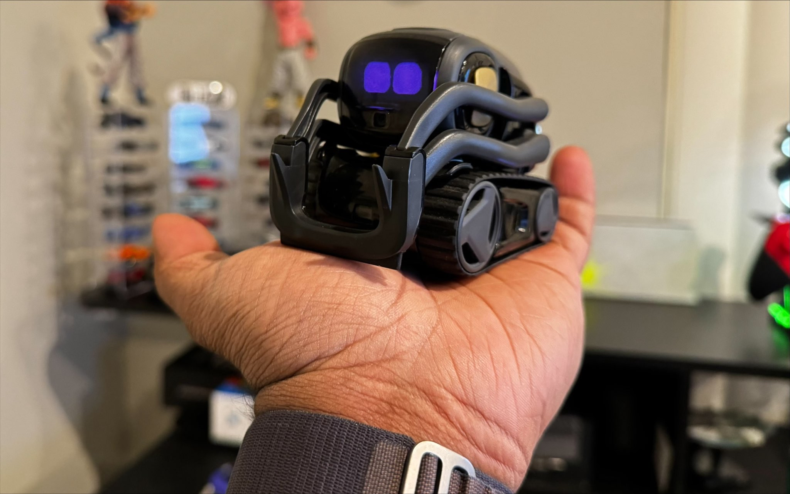

# vector-advanced-ai

> Vector with Advanced AI compatibilities



## Setup

### wire-pod

Anki Servers are down. You need to first setup a local server using [wire-pod](https://github.com/kercre123/wire-pod).

### vector-sdk

Setup the sdk using my [fork](https://github.com/kingardor/vector-python-sdk).

### nanoowl

Setup [nanoowl](https://github.com/NVIDIA-AI-IOT/nanoowl) for object detection using TensorRT

## Run sample

```sh
python3 app.py
```